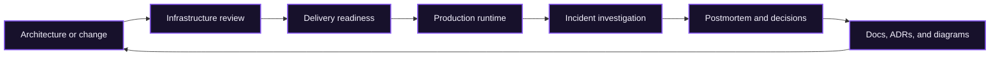

<div align="center">
  

  <br>

  [](https://agentskills.io)
  [](#skill-catalog)
  [](https://github.com/BRYANN2K/skills/actions/workflows/validate.yml)
  [](LICENSE)

  **Production-grade workflows for infrastructure, DevOps, and developer documentation.**

  Built for Claude Code, Codex, Cursor, OpenCode, Hermes, and any client that supports the open [Agent Skills](https://agentskills.io) format.
</div>

---

## Why this repository exists

Most public skills are either giant reference dumps or short checklists. Both fail under pressure: the first wastes context, the second skips the decisions that matter.

This collection takes a different approach:

- **Evidence before conclusions** — inspect real plans, manifests, telemetry, code, and docs.
- **Read-only first** — investigation never silently becomes deployment or remediation.
- **Progressive disclosure** — compact workflows load focused references only when needed.
- **Explicit safety gates** — risky mutations require scope, impact, rollback, and approval.
- **Verifiable completion** — every skill defines observable success criteria.
- **Vendor-aware, not vendor-locked** — use native tools when present and portable fallbacks otherwise.

These are original, rebuilt workflows. They combine the strongest patterns found across respected public skill repositories and engineering standards instead of concatenating upstream prompts. See [NOTICE.md](NOTICE.md) for design lineage and attribution.

## Skill catalog

### Infrastructure

| Skill | Use it for | Rebuilt from the best ideas in |
|---|---|---|
| [terraform-change-safety](infrastructure/terraform-change-safety) | Terraform/OpenTofu authoring, plan review, state migrations, production change verdicts | Terraform engineering + plan review + production pre-flight |
| [kubernetes-production-engineering](infrastructure/kubernetes-production-engineering) | Kubernetes generation, review, hardening, validation, and live diagnosis | Failure-mode-first K8s + GitOps validation + SRE troubleshooting |
| [cloud-architecture-review](infrastructure/cloud-architecture-review) | Evidence-based reviews across AWS, Azure, GCP, and hybrid systems | Well-Architected + resilience modeling + cross-cloud architecture review |

### DevOps

| Skill | Use it for | Rebuilt from the best ideas in |
|---|---|---|
| [sre-incident-investigation](devops/sre-incident-investigation) | Triage, hypothesis-driven investigation, mitigation, and postmortems | Incident command + metrics/logs/traces + query discipline |
| [gitops-operations](devops/gitops-operations) | Static GitOps repository audits and read-only live cluster debugging | Flux repository audit + dependency-chain debugging + change safety |
| [delivery-pipeline-engineering](devops/delivery-pipeline-engineering) | CI/CD design, supply-chain security, rollout strategy, and deployment readiness | Pipeline engineering + production pre-flight + progressive delivery |

### Documentation

| Skill | Use it for | Rebuilt from the best ideas in |
|---|---|---|
| [developer-documentation](doc-writer/developer-documentation) | READMEs, tutorials, how-to guides, API docs, runbooks, migration guides, and docs audits | Diátaxis + docs-as-code + executable examples + API-first documentation |
| [architecture-decision-records](doc-writer/architecture-decision-records) | Proposed, accepted, deprecated, and superseded ADRs with real trade-offs | MADR + lightweight ADRs + decision governance |
| [software-architecture-diagrams](doc-writer/software-architecture-diagrams) | Mermaid C4-style, sequence, flow, state, ER, and deployment diagrams | Mermaid syntax + C4 thinking + architecture-first diagram design |

## Quick start

Install the full collection with a compatible skills client:

```bash
npx skills add BRYANN2K/skills
```

Or select one skill:

```bash
npx skills add BRYANN2K/skills --skill sre-incident-investigation
```

Manual project-local installation:

```bash
git clone https://github.com/BRYANN2K/skills.git /tmp/bryann2k-skills
mkdir -p .agents/skills
cp -R /tmp/bryann2k-skills/devops/sre-incident-investigation .agents/skills/
```

Common discovery paths vary by client:

| Client | Project-local path |
|---|---|
| Agent Skills / Codex / compatible clients | `.agents/skills/<skill-name>/` |
| Claude Code | `.claude/skills/<skill-name>/` |
| Cursor | `.cursor/skills/<skill-name>/` |
| OpenCode | `.opencode/skills/<skill-name>/` |
| Hermes | `~/.hermes/skills/<category>/<skill-name>/` |

Restart the client or open a new session if it caches the skill index.

## How the skills fit together



The skills are composable, not monolithic. A Terraform rollout may load `terraform-change-safety`, then `delivery-pipeline-engineering`; a production failure may load `sre-incident-investigation`, then `architecture-decision-records` to preserve the resulting decision.

## Design contract

Every skill in this repository must satisfy the same contract:

1. **Trigger precisely.** The description states both capability and use conditions.
2. **Gather context.** Never infer versions, environments, or topology when they can be inspected.
3. **Separate facts from hypotheses.** Label confidence and cite the evidence used.
4. **Default to observation.** Commands that change state are outside read-only investigation.
5. **Gate mutations.** A mutation requires explicit authorization, blast-radius analysis, and rollback.
6. **Validate the artifact.** Prefer parsers, linters, dry-runs, tests, and rendered output over visual guessing.
7. **Report honestly.** Distinguish passed, failed, skipped, unavailable, and not applicable checks.

## Repository structure

```text
skills/
├── infrastructure/
│   ├── terraform-change-safety/
│   ├── kubernetes-production-engineering/
│   └── cloud-architecture-review/
├── devops/
│   ├── sre-incident-investigation/
│   ├── gitops-operations/
│   └── delivery-pipeline-engineering/
├── doc-writer/
│   ├── developer-documentation/
│   ├── architecture-decision-records/
│   └── software-architecture-diagrams/
├── scripts/validate_skills.py
└── .github/workflows/validate.yml
```

Each skill is self-contained:

```text
skill-name/
├── SKILL.md       # Compact execution workflow
├── references/    # Deep guidance loaded only when relevant
└── templates/     # Reusable output contracts
```

## Validation

Run the same checks as CI:

```bash
python3 scripts/validate_skills.py
```

The validator checks frontmatter, directory/name alignment, description quality, file size, registry coverage, local Markdown links, and unsafe production-action wording.

## Contributing

Contributions should improve agent behavior, not add generic prose. Read [CONTRIBUTING.md](CONTRIBUTING.md) before opening a pull request.

## Security

These skills can guide high-impact infrastructure work. Read [SECURITY.md](SECURITY.md). A successful dry-run is not approval to deploy, and a skill is not a substitute for an accountable engineer.

## License

Apache License 2.0. See [LICENSE](LICENSE) and [NOTICE.md](NOTICE.md).
