<div align="center">
  

  <br>

  [](https://agentskills.io)
  [](#skill-catalog)
  [](https://github.com/BRYANN2K/skills/actions/workflows/validate.yml)
  [](LICENSE)

  **Agent workflows I use to build, operate, document, and share software.**

  Built for Claude Code, Codex, Cursor, OpenCode, Hermes, and any client that supports the open [Agent Skills](https://agentskills.io) format.
</div>

---

## About this repository

This is my growing collection of reusable Agent Skills. It is not tied to one stack or job: the catalog follows the work I do, from infrastructure and delivery to documentation, product building, and creator workflows.

Every skill should earn its place by changing how an agent works:

- inspect the evidence needed for the requested outcome;
- distinguish facts, hypotheses, decisions, and actions;
- choose the shortest safe path instead of manufacturing ceremony;
- treat a bounded request as authority for bounded local work, and re-confirm when scope or effect expands;
- load detailed references and create artifacts only when they are relevant;
- match verification to the claim and preserve the human's judgment, voice, and ownership.

The workflows are original syntheses, not bundles of copied prompts. [NOTICE.md](NOTICE.md) records the standards and public projects that materially informed them.

## Skill catalog

### Agent workflows

| Skill | Use it for |
|---|---|
| [agent-workflows](agent-workflows/agent-workflows) | Route broad agent-workflow requests to repository instructions, truthful completion evidence, or explicitly requested focus-friendly presentation |
| [verified-completion](agent-workflows/verified-completion) | Require fresh evidence for every completion claim; distinguish implemented, executed, verified, and published work without overstating results |
| [agents-md-authoring](agent-workflows/agents-md-authoring) | Create, adapt, audit, and split evidence-backed `AGENTS.md` instructions across software, infrastructure, platform, data, and documentation repositories without inventing commands, live state, or mutation authority |
| [focus-friendly-delivery](agent-workflows/focus-friendly-delivery) | Present authorized work and manual instructions in an action-first, scannable, re-entry-friendly form when explicitly requested, without inferring a diagnosis or hiding safety and evidence |

### Creator

| Skill | Use it for |
|---|---|
| [creator-workflows](creator/creator-workflows) | Route creator work between private evidence capture and opt-in prose auditing while keeping drafting and publication separately authorized |
| [build-in-public-journal](creator/build-in-public-journal) | Keep a private evidence journal of meaningful bugs, failed approaches, decisions, experiments, and results; identify safe ideas for X, LinkedIn, and a personal blog without drafting posts |
| [prose-pattern-audit](creator/prose-pattern-audit) | Detect contextual prose patterns after a draft and, only when asked, make minimal meaning-preserving edits without guessing authorship or imposing a global house style |

### Infrastructure

| Skill | Use it for |
|---|---|
| [infrastructure](infrastructure/infrastructure) | Route broad infrastructure outcomes to bootstrap, Terraform/OpenTofu, Kubernetes, or cloud architecture without imposing a lifecycle |
| [infrastructure-project-bootstrap](infrastructure/infrastructure-project-bootstrap) | Start or safely adopt an infrastructure repository through constraint discovery, reviewable non-destructive scaffolding, minimal agent rules, and structural diagnosis |
| [terraform-change-safety](infrastructure/terraform-change-safety) | Terraform/OpenTofu authoring, plan review, state migrations, and production change verdicts |
| [kubernetes-production-engineering](infrastructure/kubernetes-production-engineering) | Kubernetes generation, review, hardening, validation, and live diagnosis |
| [cloud-architecture-review](infrastructure/cloud-architecture-review) | Evidence-based reviews across AWS, Azure, GCP, and hybrid systems |

### DevOps

| Skill | Use it for |
|---|---|
| [devops](devops/devops) | Route broad delivery and operations outcomes to CI/CD, GitOps, incident work, or a precise cross-domain handoff |
| [sre-incident-investigation](devops/sre-incident-investigation) | Triage, hypothesis-driven investigation, mitigation, and postmortems |
| [gitops-operations](devops/gitops-operations) | Static GitOps repository audits and read-only live cluster debugging |
| [delivery-pipeline-engineering](devops/delivery-pipeline-engineering) | CI/CD design, supply-chain security, rollout strategy, and deployment readiness |

### Software development

| Skill | Use it for |
|---|---|
| [software-engineering](software-development/software-engineering) | Route broad software outcomes to the smallest website, web app, dashboard, CLI, TUI, or bootstrap specialist and involve Interface Studio only when visual direction is open |
| [software-project-bootstrap](software-development/software-project-bootstrap) | Start or safely adopt a software repository through project discovery, digest-bound non-destructive scaffolding, minimal agent rules, and read-only diagnosis |
| [website-production-engineering](software-development/website-production-engineering) | Build public websites around source-grounded content, a selected visual direction, conversion paths, SEO continuity, accessibility, responsive behavior, and real-browser evidence |
| [web-application-engineering](software-development/web-application-engineering) | Build stateful browser applications with explicit routes, permissions, state ownership, mutations, failure recovery, and E2E verification |
| [dashboard-application-engineering](software-development/dashboard-application-engineering) | Specialize web applications for analytical and operational dashboards with source, metric, resource, filter, role, action, partial-failure, and reconciliation contracts |
| [terminal-ui-engineering](software-development/terminal-ui-engineering) | Build full-screen terminal applications with deterministic state, focus, resize, async work, cleanup, compatibility, and PTY evidence |
| [command-line-tool-engineering](software-development/command-line-tool-engineering) | Build scriptable CLIs with stable streams, formats, exit codes, config precedence, mutation safety, signals, and black-box probes |

### Design

| Skill | Use it for |
|---|---|
| [interface-studio](design/interface-studio) | Serve as the sole design front door: route targeted copy, direction, system, motion, or QA work directly, and coordinate the full product-to-interface studio only for new or materially open interfaces; real-time graphics remain opt-in |
| [product-story-and-copy](design/product-story-and-copy) | Turn product evidence into positioning, claims, message hierarchy, conversion copy, state microcopy, and marketing requirements without invented proof |
| [design-direction](design/design-direction) | Convert cited references into original rendered concepts—including conditional 3D scene/fallback directions—with product-specific signatures and no-copy boundaries |
| [design-system-first](design/design-system-first) | Handle explicit system work or consolidate observed reuse into foundations, semantic tokens, composition, components, states, responsive/accessibility behavior, review evidence, and a project-local UI contract |
| [interface-motion](design/interface-motion) | Design and verify UI or scroll-linked scene motion that serves causality, feedback, orientation, continuity, progression, or hierarchy with interruption, reduced-motion, pause and cleanup behavior |
| [anti-slop-review](design/anti-slop-review) | Produce evidence-linked findings across copy, composition, data/states, motion, accessibility, responsive/runtime quality, and conditional GPU fallback, performance and lifecycle |

### Documentation

| Skill | Use it for |
|---|---|
| [documentation](doc-writer/documentation) | Route broad documentation outcomes to developer docs, ADRs, diagrams, or the smallest necessary combination |
| [developer-documentation](doc-writer/developer-documentation) | READMEs, tutorials, how-to guides, API docs, runbooks, migration guides, and documentation audits |
| [architecture-decision-records](doc-writer/architecture-decision-records) | Proposed, accepted, deprecated, and superseded ADRs with real trade-offs |
| [software-architecture-diagrams](doc-writer/software-architecture-diagrams) | Mermaid C4-style, sequence, flow, state, ER, and deployment diagrams |

## Quick start

Install the collection with a compatible skills client:

```bash
npx skills add BRYANN2K/skills
```

Or install one skill:

```bash
npx skills add BRYANN2K/skills --skill verified-completion
```

Manual project-local installation:

```bash
git clone https://github.com/BRYANN2K/skills.git /tmp/bryann2k-skills
mkdir -p .agents/skills
cp -R /tmp/bryann2k-skills/agent-workflows/verified-completion .agents/skills/
```

Common discovery paths vary by client:

| Client | Project-local path |
|---|---|
| Agent Skills / Codex / compatible clients | `.agents/skills/<skill-name>/` |
| Claude Code | `.claude/skills/<skill-name>/` |
| Cursor | `.cursor/skills/<skill-name>/` |
| OpenCode | `.opencode/skills/<skill-name>/` |
| Hermes | `~/.hermes/skills/<category>/<skill-name>/` |

Restart the client or open a new session if it caches its skill index.

## How requests move through the collection

A clear request goes straight to its specialist. Broad, ambiguous, or genuinely cross-domain work enters through one domain entry point, selects one primary owner, and adds bounded consultations only when another specialty must answer a specific question.

<p align="center">
  
</p>

<p align="center"><sub>Rendered from the <a href="assets/skills-routing-map.mmd">Mermaid source</a>.</sub></p>

Skills remain independent and directly invocable. Consultations return evidence to the current owner; ownership transfers only when the remaining outcome truly belongs to another specialist. Verification stays proportional to the claim, and reusable guidance is updated only when a lesson is worth preserving.

## Design contract

Every skill in this repository must:

1. **Trigger precisely.** Its description says what it does and when to load it.
2. **Gather context.** It inspects available source material instead of guessing.
3. **Preserve boundaries.** It separates observation from mutation and private material from public output.
4. **Gate risk.** High-impact or privacy-sensitive actions require explicit scope and approval.
5. **Use progressive disclosure.** The main workflow stays compact; detailed branches live in references and templates.
6. **Verify the artifact.** Tests, parsers, linters, dry-runs, rendered output, or other observable checks back completion claims.
7. **Report honestly.** Passed, failed, skipped, unavailable, and not applicable are different results.

## Repository structure

```text
.
├── agent-workflows/
│   ├── agent-workflows/
│   ├── verified-completion/
│   ├── agents-md-authoring/
│   └── focus-friendly-delivery/
├── creator/
│   ├── creator-workflows/
│   ├── build-in-public-journal/
│   └── prose-pattern-audit/
├── infrastructure/
│   ├── infrastructure/
│   ├── infrastructure-project-bootstrap/
│   ├── terraform-change-safety/
│   ├── kubernetes-production-engineering/
│   └── cloud-architecture-review/
├── devops/
│   ├── devops/
│   ├── sre-incident-investigation/
│   ├── gitops-operations/
│   └── delivery-pipeline-engineering/
├── software-development/
│   ├── software-engineering/
│   ├── software-project-bootstrap/
│   ├── website-production-engineering/
│   ├── web-application-engineering/
│   ├── dashboard-application-engineering/
│   ├── terminal-ui-engineering/
│   └── command-line-tool-engineering/
├── design/
│   ├── interface-studio/
│   ├── product-story-and-copy/
│   ├── design-direction/
│   ├── design-system-first/
│   ├── interface-motion/
│   └── anti-slop-review/
├── doc-writer/
│   ├── documentation/
│   ├── developer-documentation/
│   ├── architecture-decision-records/
│   └── software-architecture-diagrams/
├── scripts/
│   ├── validate_skills.py
│   └── run_skill_tests.py
├── skill-registry.json
└── .github/workflows/validate.yml
```

A skill can include progressively disclosed resources:

```text
skill-name/
├── SKILL.md       # Execution workflow and boundaries
├── references/    # Detailed guidance loaded when needed
├── templates/     # Reusable artifact contracts
└── scripts/       # Optional deterministic helpers and tests
```

## Validation

Run the repository checks:

```bash
python3 scripts/validate_skills.py
python3 scripts/run_skill_tests.py
```

CI also validates every skill against the official Agent Skills reference implementation. The local validator checks frontmatter, directory/name alignment, description quality, registry coverage, local Markdown links, and operational safety contracts.

## Contributing

Contributions should improve agent behavior, not add generic prose. Read [CONTRIBUTING.md](CONTRIBUTING.md) before opening a pull request.

## Security

Some skills guide high-impact operational work; others handle private working material. Read [SECURITY.md](SECURITY.md). A skill is not authorization to deploy, publish, or expose sensitive data.

## License

Apache License 2.0. See [LICENSE](LICENSE) and [NOTICE.md](NOTICE.md).
