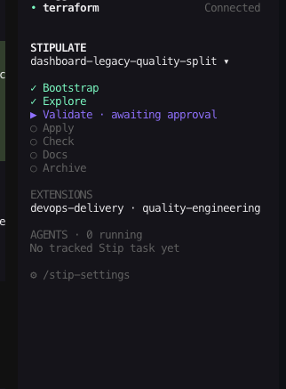
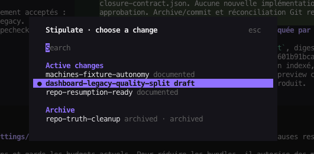
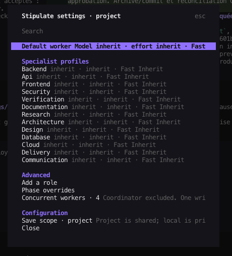
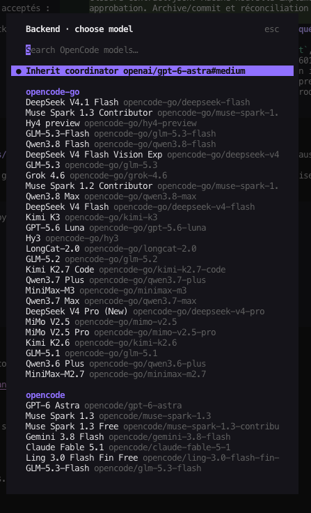

<div align="center">


<br>

[](#the-seven-skills)
[](#bring-the-right-expertise)
[](#quick-start)
[](LICENSE)
[](https://x.com/bryann2k_dev)

**Explore in natural language. Agree on a spec. Build with evidence.**

Seven core skills, optional domain extensions, and a shared contract that stays with your project.
OpenCode v2 adds native subagent orchestration, a workflow sidebar, and model settings.
Uses the Agent Skills format for **Codex, Claude Code, Grok Build, and OpenCode v2**.

[Get started](#quick-start) · [See the workflow](#how-it-works) · [OpenCode plugin](#native-orchestration-in-opencode-v2) · [Browse extensions](#bring-the-right-expertise) · [Read the guide](docs/getting-started.md)

</div>

---

## Why Stip?

A conversation can move quickly. The decisions it produces should remain clear when implementation starts, requirements change, or a new session picks up the work.

**Stipulate Skills**, or **Stip**, connects that conversation to a durable development workflow:

- **Prompt freely.** Explore an idea, ask questions, and revise the direction in plain language.
- **Make the agreement explicit.** Review the specification before the agent builds.
- **Check the actual result.** Tie acceptance criteria to current, inspectable evidence.
- **Keep what you learned.** Update documentation and archive the accepted behavior with a local commit.

Start a new project or adopt an existing repository. Bootstrap preserves useful conventions and maps what already exists. Extensions add relevant expertise without loading every domain into every change.

## Quick start

You need **Node.js 22.20+/npm**, **Python 3.10+**, **Git**, and a supported coding client. The native OpenCode v2 plugin is developed against **OpenCode 2 beta-19296**. The pinned skills installer also requires Node.js 22.20+, including skill-only installations through this npx entrypoint.

### 1. Install the complete package

For **OpenCode v2**, run from your project directory:

```sh
npx github:BRYANN2K/stipulate-skills
```

This installs **all seven skills, all 28 bundled extensions, the seven `/stip-*` commands, and the native OpenCode plugin** in one run. The plugin adds the workflow sidebar, native worker tracking, and `/stip-settings`. For installation across projects:

```sh
npx github:BRYANN2K/stipulate-skills --global
```

**Using OpenCode through Orca?** Run the global installation command in a shell terminal inside Orca. The installer follows `OPENCODE_CONFIG_DIR`, so the plugin and commands land in the same configuration directory as Orca's OpenCode sessions.

In an already open OpenCode v2 session, run **`/restart`**. If the sidebar or settings command has not loaded, restart the CLI. Then use **`/stip-settings`** to choose models for worker roles; unset roles inherit the coordinator model.

The launcher defaults to OpenCode. To include Codex and Claude Code:

```sh
npx github:BRYANN2K/stipulate-skills --agent opencode codex claude-code
```

Use `--dry-run` to preview or `--yes` for unattended installation. This command runs the package directly from GitHub; no separately published npm package is required. It copies the skills, installs the commands, and prepares the plugin with its locked dependencies in a durable project or global directory. Existing customized commands or plugin source block an update. Your OpenCode configuration files are preserved. Use `--no-opencode-plugin` to install only skills and commands. [Installation, updates, and removal →](docs/installation.md)

For skill-only installation, the standard command remains available:

```sh
npx skills add BRYANN2K/stipulate-skills --skill '*' --agent codex
```

`npx skills add` does not run Stip's command or native plugin installers. For OpenCode's complete setup, use the Stip launcher above. Extensions travel inside `stip-bootstrap` and are selected per change. [Client setup and verification →](docs/clients.md)

### 2. Open your project in your coding client

Open the repository you want to work on. In Codex, send this in the chat composer:

```text
$stip-bootstrap Adopt this repository. Preserve its conventions, map the project,
and identify the relevant domain extensions.
```

For a new project, explain its intent and initialize Git first if necessary. Bootstrap prepares `AGENTS.md` and `.workflow/`; it makes all 28 extensions available locally without choosing your stack or selecting domains for a change.

In Claude Code, Grok Build, and OpenCode v2, invoke `/stip-bootstrap` instead. For explicit OpenCode command files, follow [slash-command setup](docs/clients.md#explicit-opencode-slash-commands). Bootstrap also creates or extends `CLAUDE.md` with an import of `AGENTS.md`, so Claude uses the same project guidance.

### 3. Explore your first change

```text
$stip-explore Let's add a sign-in flow. Reuse the existing foundations and help
me define the scope, user journey, and acceptance criteria.
```

The `$stip-*` examples are **Codex chat prompts**, not terminal commands. Use `/stip-*` in Claude Code, Grok Build, and OpenCode v2. The agent uses the bundled Python runtime for lifecycle operations.

[Walk through a complete feature, from idea to archive →](docs/getting-started.md#walk-through-your-first-feature)

## How it works


**You own the agreement; the agent carries out the approved work.** During validation, read the Markdown spec, edit it directly or ask for revisions, and explicitly approve its current version. Implementation follows that contract.

A failed check returns to implementation. New requirements return to validation. After a successful check, documentation and archive close the change. Start the next feature at explore; bootstrap is not a repeated feature audit.

## Native orchestration in OpenCode v2

Explore with your main agent. During validation, agree on an execution plan alongside the spec. The coordinator delegates bounded tasks to native OpenCode subagents, reviews their contributions, and takes the change through check, docs, and archive. An optional research helper can answer a specific question while exploration stays with the main agent.

### See where the work stands

The **STIPULATE** panel sits below the MCP section. It shows the selected change, its seven stages, relevant extensions, and tracked workers. Click a stage to read its associated document. Click the change name to switch between active work and archived changes.

| Workflow sidebar | Change selector |
| --- | --- |
|  |  |

The selected contract is awaiting approval. Once workers are dispatched, the panel shows their activity and lets you open their native sessions. Returned work stays pending until the coordinator reviews and accepts it; completion alone does not pass the check.

### Give each role the right model

Open **`/stip-settings`** to choose a default worker profile or assign models to backend, frontend, API, security, verification, documentation, and other roles. **Inherit** uses the coordinator's effective model. The picker lists models available through your OpenCode configuration; effort and Fast choices follow the capabilities of the selected model.

| Worker settings | Model selector |
| --- | --- |
|  |  |

Use phase overrides when a role needs different settings during implementation or review. Save shared choices at project scope, or keep personal overrides local. Concurrency limits apply to workers; the coordinator is separate, and shared-checkout writes are serialized. The screenshots show a user's configuration, so the model list and concurrency value can differ from yours.

Execution plans belong to the approved specification version. Existing v1 changes continue to work; adding an execution plan requires explicit migration and renewed approval.

The plugin uses OpenCode subagents. Codex and Claude Code use their own native agent files; see [native agent configuration](docs/native-agents.md). There is no runtime selector in OpenCode settings.

[Panel and settings guide →](docs/opencode-plugin-ui.md) · [Orchestration contract and compatibility →](docs/orchestration-contract.md)

## The seven skills

| Skill | What it does | What you get |
| --- | --- | --- |
| [stip-bootstrap](skills/stip-bootstrap/SKILL.md) | Adopts a new or existing project. | Project map, configuration, and workflow guidance. |
| [stip-explore](skills/stip-explore/SKILL.md) | Explores intent with relevant available extensions. | A bounded idea and recorded decisions. |
| [stip-validate](skills/stip-validate/SKILL.md) | Turns the discussion into a contract for user review. | Specification and acceptance criteria. |
| [stip-apply](skills/stip-apply/SKILL.md) | Builds and corrects within the approved scope. | Implementation and relevant tests. |
| [stip-check](skills/stip-check/SKILL.md) | Reconciles every criterion with current evidence. | Passed, failed, or unverified results. |
| [stip-docs](skills/stip-docs/SKILL.md) | Updates documentation affected by the change. | Documentation grounded in the implementation. |
| [stip-archive](skills/stip-archive/SKILL.md) | Promotes the accepted spec and closes the change. | Archived records and a scoped local commit. |

## Bring the right expertise

**28 optional extensions. Seven entry points stay seven.** Extensions contribute domain questions, requirements, and verification guidance to the same workflow. They are local reference packages, not extra top-level skills or executable plugins.

| Domain | Available extensions |
| --- | --- |
| Product and experience | `product-strategy`, `user-research`, `storytelling`, `ux-design`, `visual-design`, `design-system`, `content-design`, `accessibility` |
| Application engineering | `frontend-engineering`, `backend-engineering`, `api-integrations`, `database-engineering`, `mobile-engineering`, `desktop-engineering`, `cli-tooling` |
| Infrastructure and operations | `cloud-engineering`, `devops-delivery`, `sre-operations`, `release-management` |
| Data, AI, and assurance | `data-engineering`, `ai-engineering`, `analytics-experimentation`, `quality-engineering`, `security-engineering`, `privacy-engineering` |
| Reach and support | `build-in-public`, `seo-discoverability`, `customer-support` |

The complete catalog is included in the installation. `$stip-bootstrap` copies it into `.workflow/extensions/` and registers available domains in the project configuration. Existing configured packages, customizations, and disabled entries are preserved.

**Selection happens during `stip-explore` for each change.** The agent reads only the relevant phase references for selected domains. A cloud-only change does not need design; existing domain work can be reused instead of repeated. Build-in-public guidance does not authorize posting on your behalf.

[Extension setup, selection, and updates →](docs/extensions.md)

## Decisions live with your project

```text
AGENTS.md                    # Project instructions and workflow guidance
.workflow/
  project.md                 # Intent, project map, commands, known gaps
  config.json                # Available extensions and settings
  specs/                     # Currently accepted behavior
  extensions/                # Optional installed domain packages
  changes/
    add-login/
      proposal.md            # Context and decisions
      spec.md                # Desired behavior and acceptance criteria
      tasks.md               # Optional implementation breakdown
      evidence.md            # Verification evidence
      state.json             # Lifecycle state and approved version
  archive/                   # Closed changes
```

The example change appears only when you explore it. Bootstrap preserves existing useful files and adds a bounded guidance block to `AGENTS.md`; it does not fabricate a sample feature.

## What the workflow enforces

- **Approval belongs to a version.** Changes to the bound contract or selected extension guidance invalidate it.
- **Completion needs evidence.** Missing or failed criteria block progression; check is tied to the source snapshot.
- **Commits stay scoped.** Archive rejects stale evidence and conflicting Git state rather than absorbing unrelated work.
- **Publishing is separate.** Archive creates a local commit. It does not push or deploy.

The Python workflow runtime is local and offline, with no third-party Python dependencies or telemetry. Installing the optional OpenCode plugin downloads locked JavaScript dependencies; native worker calls use the providers configured in OpenCode. Your coding agent still requires its normal setup. Recorded evidence is an attestation, not proof that its author was truthful; passing the workflow does not certify a product as production-ready.

The native OpenCode integration has been exercised in an isolated terminal project through archive, including native subagents, model/effort settings and visual UI checks. See the [qualification report](docs/verification.md) for evidence and tested boundaries.

[Detailed guarantees, limits, and migration →](docs/getting-started.md#guarantees-and-limits)

## Documentation

| Start here | For |
| --- | --- |
| [Installer reference](docs/installation.md) | Plugin installation, scope, updates, and removal. |
| [Installation and first-feature guide](docs/getting-started.md) | Setup, prompt examples, updates, removal, and troubleshooting. |
| [Workflow reference](docs/workflow.md) | Lifecycle commands, contracts, state, and evidence. |
| [Domain extensions](docs/extensions.md) | Package installation, selection, and contribution rules. |
| [Contributing](CONTRIBUTING.md) | Engine changes and validation commands. |
| [Security](SECURITY.md) | Boundaries and security reporting. |

## License

Apache License 2.0. See [LICENSE](LICENSE) and [NOTICE.md](NOTICE.md).
