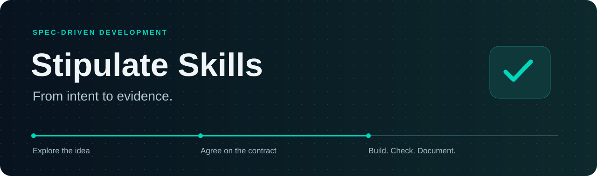
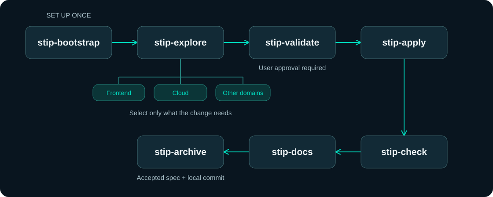

<div align="center">



<br>

[](#the-seven-skills)
[](#bring-the-right-expertise)
[](#quick-start)
[](LICENSE)
[](https://x.com/bryann2k_dev)

**Explore in natural language. Agree on a spec. Build with evidence.**

Seven core skills, optional domain extensions, and a shared contract that stays with your project.
Designed for **GPT-6 Astra in Codex** using the Agent Skills format.

[Get started](#quick-start) · [See the workflow](#how-it-works) · [Browse extensions](#bring-the-right-expertise) · [Read the guide](docs/getting-started.md)

</div>

---

## Why Stip?

A conversation can move quickly. The decisions it produces should remain clear when implementation starts, requirements change, or a new session picks up the work.

**Stipulate Skills**, or **Stip**, connects that conversation to a durable development workflow:

- **Prompt freely.** Explore an idea, ask questions, and revise the direction in plain language.
- **Make the agreement explicit.** Review the specification before the agent builds.
- **Check the actual result.** Tie acceptance criteria to current, inspectable evidence.
- **Keep what you learned.** Update documentation and archive the accepted behavior with a local commit.

Start a new project or adopt an existing repository. Bootstrap preserves useful conventions and maps what already exists. Extensions add relevant expertise without loading every domain into every change.

## Quick start

You need **Python 3.10+**, **Git**, and a coding-agent environment with skill support. Commands below use a macOS/Linux shell.

> **Workflow branch:** this rebuild currently lives on `codex/spec-workflow-core`. `main` still contains the legacy collection. Use the branch in the clone command below.

### 1. Install the core

Run in a terminal:

```sh
git clone --branch codex/spec-workflow-core https://github.com/BRYANN2K/stipulate-skills.git
cd stipulate-skills
python3 scripts/install.py --destination "$HOME/.agents/skills" --dry-run
python3 scripts/install.py --destination "$HOME/.agents/skills"
```

This installs exactly seven skills for your user account. Unrelated skills are preserved; modified or foreign installations are not overwritten. Check your client's skill catalog and open a new conversation if needed.

Prefer a project-local install? Use `/absolute/path/to/your-project/.agents/skills` as the destination. [Installation options and troubleshooting →](docs/getting-started.md)

### 2. Open your project in Codex

Open the repository you want to work on, then send this in the chat composer:

```text
$stip-bootstrap Adopt this repository. Preserve its conventions, map the project,
and identify the relevant domain extensions.
```

For a new project, explain its intent and initialize Git first if necessary. Bootstrap prepares `AGENTS.md` and `.workflow/`; it does not install domain extensions or choose your stack.

### 3. Explore your first change

```text
$stip-explore Let's add a sign-in flow. Reuse the existing foundations and help
me define the scope, user journey, and acceptance criteria.
```

The `$stip-*` examples are **chat prompts**, not terminal commands. The agent uses the bundled Python runtime for lifecycle operations.

[Walk through a complete feature, from idea to archive →](docs/getting-started.md#walk-through-your-first-feature)

## How it works



**You own the agreement; the agent carries out the approved work.** During validation, read the Markdown spec, edit it directly or ask for revisions, and explicitly approve its current version. Implementation follows that contract.

A failed check returns to implementation. New requirements return to validation. After a successful check, documentation and archive close the change. Start the next feature at explore; bootstrap is not a repeated feature audit.

## The seven skills

| Skill | What it does | What you get |
| --- | --- | --- |
| [stip-bootstrap](skills/stip-bootstrap/SKILL.md) | Adopts a new or existing project. | Project map, configuration, and workflow guidance. |
| [stip-explore](skills/stip-explore/SKILL.md) | Explores intent with relevant available extensions. | A bounded idea and recorded decisions. |
| [stip-validate](skills/stip-validate/SKILL.md) | Turns the discussion into a contract for user review. | Specification and acceptance criteria. |
| [stip-apply](skills/stip-apply/SKILL.md) | Builds and corrects within the approved scope. | Implementation and relevant tests. |
| [stip-check](skills/stip-check/SKILL.md) | Reconciles every criterion with current evidence. | Passed, failed, or unverified results. |
| [stip-docs](skills/stip-docs/SKILL.md) | Updates documentation affected by the change. | Documentation grounded in the implementation. |
| [stip-archive](skills/stip-archive/SKILL.md) | Promotes the accepted spec and closes the change. | Archived records and a scoped local commit. |

## Bring the right expertise

**28 optional extensions. Seven entry points stay seven.** Extensions contribute domain questions, requirements, and verification guidance to the same workflow. They are local reference packages, not extra top-level skills or executable plugins.

| Domain | Available extensions |
| --- | --- |
| Product and experience | `product-strategy`, `user-research`, `storytelling`, `ux-design`, `visual-design`, `design-system`, `content-design`, `accessibility` |
| Application engineering | `frontend-engineering`, `backend-engineering`, `api-integrations`, `database-engineering`, `mobile-engineering`, `desktop-engineering`, `cli-tooling` |
| Infrastructure and operations | `cloud-engineering`, `devops-delivery`, `sre-operations`, `release-management` |
| Data, AI, and assurance | `data-engineering`, `ai-engineering`, `analytics-experimentation`, `quality-engineering`, `security-engineering`, `privacy-engineering` |
| Reach and support | `build-in-public`, `seo-discoverability`, `customer-support` |

Install only what your bootstrapped project needs, from the Stipulate Skills checkout:

```sh
python3 scripts/install_extensions.py --project "/absolute/path/to/your-project" \
  --extension frontend-engineering --extension accessibility --dry-run
python3 scripts/install_extensions.py --project "/absolute/path/to/your-project" \
  --extension frontend-engineering --extension accessibility
```

Installation makes these extensions available. **Selection happens during `stip-explore` for each change.** An infrastructure-only change does not need design; existing domain work can be reused instead of repeated. Build-in-public guidance does not authorize posting on your behalf.

[Extension setup, selection, and updates →](docs/extensions.md)

## Decisions live with your project

```text
AGENTS.md                    # Project instructions and workflow guidance
.workflow/
  project.md                 # Intent, project map, commands, known gaps
  config.json                # Available extensions and settings
  specs/                     # Currently accepted behavior
  extensions/                # Optional installed domain packages
  changes/
    add-login/
      proposal.md            # Context and decisions
      spec.md                # Desired behavior and acceptance criteria
      tasks.md               # Optional implementation breakdown
      evidence.md            # Verification evidence
      state.json             # Lifecycle state and approved version
  archive/                   # Closed changes
```

The example change appears only when you explore it. Bootstrap preserves existing useful files and adds a bounded guidance block to `AGENTS.md`; it does not fabricate a sample feature.

## What the workflow enforces

- **Approval belongs to a version.** Changes to the bound contract or selected extension guidance invalidate it.
- **Completion needs evidence.** Missing or failed criteria block progression; check is tied to the source snapshot.
- **Commits stay scoped.** Archive rejects stale evidence and conflicting Git state rather than absorbing unrelated work.
- **Publishing is separate.** Archive creates a local commit. It does not push or deploy.

The runtime is local and offline, with no third-party Python dependencies or telemetry. Your coding agent still requires its normal setup. Recorded evidence is an attestation, not proof that its author was truthful; passing the workflow does not certify a product as production-ready.

[Detailed guarantees, limits, and migration →](docs/getting-started.md#guarantees-and-limits)

## Documentation

| Start here | For |
| --- | --- |
| [Installation and first-feature guide](docs/getting-started.md) | Setup, prompt examples, updates, removal, and troubleshooting. |
| [Workflow reference](docs/workflow.md) | Lifecycle commands, contracts, state, and evidence. |
| [Domain extensions](docs/extensions.md) | Package installation, selection, and contribution rules. |
| [Contributing](CONTRIBUTING.md) | Engine changes and validation commands. |
| [Security](SECURITY.md) | Boundaries and security reporting. |

## License

Apache License 2.0. See [LICENSE](LICENSE) and [NOTICE.md](NOTICE.md).
