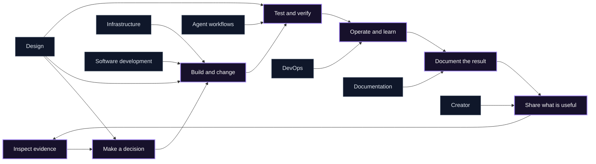

<div align="center">
  

  <br>

  [](https://agentskills.io)
  [](#skill-catalog)
  [](https://github.com/BRYANN2K/skills/actions/workflows/validate.yml)
  [](LICENSE)

  **Agent workflows I use to build, operate, document, and share software.**

  Built for Claude Code, Codex, Cursor, OpenCode, Hermes, and any client that supports the open [Agent Skills](https://agentskills.io) format.
</div>

---

## About this repository

This is my growing collection of reusable Agent Skills. It is not tied to one stack or job: the catalog follows the work I do, from infrastructure and delivery to documentation, product building, and creator workflows.

Every skill should earn its place by changing how an agent works:

- inspect evidence before reaching a conclusion;
- distinguish facts, hypotheses, decisions, and actions;
- keep risky mutations behind explicit approval;
- load detailed references only when they are relevant;
- produce artifacts with observable verification;
- preserve the human's judgment, voice, and ownership.

The workflows are original syntheses, not bundles of copied prompts. [NOTICE.md](NOTICE.md) records the standards and public projects that materially informed them.

## Skill catalog

### Agent workflows

| Skill | Use it for |
|---|---|
| [verified-completion](agent-workflows/verified-completion) | Require fresh evidence for every completion claim; distinguish implemented, executed, verified, and published work without overstating results |
| [agents-md-authoring](agent-workflows/agents-md-authoring) | Create, adapt, audit, and split evidence-backed `AGENTS.md` instructions across software, infrastructure, platform, data, and documentation repositories without inventing commands, live state, or mutation authority |

### Creator

| Skill | Use it for |
|---|---|
| [build-in-public-journal](creator/build-in-public-journal) | Keep a private evidence journal of meaningful bugs, failed approaches, decisions, experiments, and results; identify safe ideas for X, LinkedIn, and a personal blog without drafting posts |

### Infrastructure

| Skill | Use it for |
|---|---|
| [infrastructure-project-bootstrap](infrastructure/infrastructure-project-bootstrap) | Start or safely adopt an infrastructure repository through constraint discovery, reviewable non-destructive scaffolding, minimal agent rules, and structural diagnosis |
| [terraform-change-safety](infrastructure/terraform-change-safety) | Terraform/OpenTofu authoring, plan review, state migrations, and production change verdicts |
| [kubernetes-production-engineering](infrastructure/kubernetes-production-engineering) | Kubernetes generation, review, hardening, validation, and live diagnosis |
| [cloud-architecture-review](infrastructure/cloud-architecture-review) | Evidence-based reviews across AWS, Azure, GCP, and hybrid systems |

### DevOps

| Skill | Use it for |
|---|---|
| [sre-incident-investigation](devops/sre-incident-investigation) | Triage, hypothesis-driven investigation, mitigation, and postmortems |
| [gitops-operations](devops/gitops-operations) | Static GitOps repository audits and read-only live cluster debugging |
| [delivery-pipeline-engineering](devops/delivery-pipeline-engineering) | CI/CD design, supply-chain security, rollout strategy, and deployment readiness |

### Software development

| Skill | Use it for |
|---|---|
| [software-project-bootstrap](software-development/software-project-bootstrap) | Start or safely adopt a software repository through project discovery, digest-bound non-destructive scaffolding, minimal agent rules, and read-only diagnosis |
| [website-production-engineering](software-development/website-production-engineering) | Build public websites around approved content, conversion paths, SEO continuity, accessibility, responsive behavior, and real-browser evidence |
| [web-application-engineering](software-development/web-application-engineering) | Build stateful browser applications with explicit routes, permissions, state ownership, mutations, failure recovery, and E2E verification |
| [dashboard-application-engineering](software-development/dashboard-application-engineering) | Specialize web applications for analytical and operational dashboards with source, metric, resource, filter, role, action, partial-failure, and reconciliation contracts |
| [terminal-ui-engineering](software-development/terminal-ui-engineering) | Build full-screen terminal applications with deterministic state, focus, resize, async work, cleanup, compatibility, and PTY evidence |
| [command-line-tool-engineering](software-development/command-line-tool-engineering) | Build scriptable CLIs with stable streams, formats, exit codes, config precedence, mutation safety, signals, and black-box probes |

### Design

| Skill | Use it for |
|---|---|
| [web-craft](design/web-craft) | Orchestrate product truth, copy, direction, design-system review, explicit human approval, project-local UI instructions, frontend implementation, motion, and anti-slop verification |
| [product-story-and-copy](design/product-story-and-copy) | Turn product evidence into positioning, claims, message hierarchy, conversion copy, state microcopy, and marketing requirements without invented proof |
| [design-direction](design/design-direction) | Convert cited visual, system, motion, and data references into one original product-specific direction and no-go list without cloning |
| [design-system-first](design/design-system-first) | Define foundations, semantic tokens, composition, components, states, responsive/accessibility behavior, review evidence, and a project-local UI contract before frontend code |
| [interface-motion](design/interface-motion) | Design and verify motion that serves causality, feedback, orientation, continuity, progression, or hierarchy with interruption and reduced-motion behavior |
| [anti-slop-review](design/anti-slop-review) | Produce evidence-linked findings across copy, composition, system fidelity, data, states, motion, accessibility, responsive, marketing, and runtime quality |

### Documentation

| Skill | Use it for |
|---|---|
| [developer-documentation](doc-writer/developer-documentation) | READMEs, tutorials, how-to guides, API docs, runbooks, migration guides, and documentation audits |
| [architecture-decision-records](doc-writer/architecture-decision-records) | Proposed, accepted, deprecated, and superseded ADRs with real trade-offs |
| [software-architecture-diagrams](doc-writer/software-architecture-diagrams) | Mermaid C4-style, sequence, flow, state, ER, and deployment diagrams |

## Quick start

Install the collection with a compatible skills client:

```bash
npx skills add BRYANN2K/skills
```

Or install one skill:

```bash
npx skills add BRYANN2K/skills --skill verified-completion
```

Manual project-local installation:

```bash
git clone https://github.com/BRYANN2K/skills.git /tmp/bryann2k-skills
mkdir -p .agents/skills
cp -R /tmp/bryann2k-skills/agent-workflows/verified-completion .agents/skills/
```

Common discovery paths vary by client:

| Client | Project-local path |
|---|---|
| Agent Skills / Codex / compatible clients | `.agents/skills/<skill-name>/` |
| Claude Code | `.claude/skills/<skill-name>/` |
| Cursor | `.cursor/skills/<skill-name>/` |
| OpenCode | `.opencode/skills/<skill-name>/` |
| Hermes | `~/.hermes/skills/<category>/<skill-name>/` |

Restart the client or open a new session if it caches its skill index.

## How the collection fits together



Skills remain independent and composable. A project can verify completion claims, move from architecture review to delivery and incident investigation, document the result, and capture build-in-public ideas without loading one monolithic prompt.

## Design contract

Every skill in this repository must:

1. **Trigger precisely.** Its description says what it does and when to load it.
2. **Gather context.** It inspects available source material instead of guessing.
3. **Preserve boundaries.** It separates observation from mutation and private material from public output.
4. **Gate risk.** High-impact or privacy-sensitive actions require explicit scope and approval.
5. **Use progressive disclosure.** The main workflow stays compact; detailed branches live in references and templates.
6. **Verify the artifact.** Tests, parsers, linters, dry-runs, rendered output, or other observable checks back completion claims.
7. **Report honestly.** Passed, failed, skipped, unavailable, and not applicable are different results.

## Repository structure

```text
.
├── agent-workflows/
│   ├── verified-completion/
│   └── agents-md-authoring/
├── creator/
│   └── build-in-public-journal/
├── infrastructure/
│   ├── infrastructure-project-bootstrap/
│   ├── terraform-change-safety/
│   ├── kubernetes-production-engineering/
│   └── cloud-architecture-review/
├── devops/
│   ├── sre-incident-investigation/
│   ├── gitops-operations/
│   └── delivery-pipeline-engineering/
├── software-development/
│   ├── software-project-bootstrap/
│   ├── website-production-engineering/
│   ├── web-application-engineering/
│   ├── dashboard-application-engineering/
│   ├── terminal-ui-engineering/
│   └── command-line-tool-engineering/
├── design/
│   ├── web-craft/
│   ├── product-story-and-copy/
│   ├── design-direction/
│   ├── design-system-first/
│   ├── interface-motion/
│   └── anti-slop-review/
├── doc-writer/
│   ├── developer-documentation/
│   ├── architecture-decision-records/
│   └── software-architecture-diagrams/
├── scripts/
│   ├── validate_skills.py
│   └── run_skill_tests.py
├── skill-registry.json
└── .github/workflows/validate.yml
```

A skill can include progressively disclosed resources:

```text
skill-name/
├── SKILL.md       # Execution workflow and boundaries
├── references/    # Detailed guidance loaded when needed
├── templates/     # Reusable artifact contracts
└── scripts/       # Optional deterministic helpers and tests
```

## Validation

Run the repository checks:

```bash
python3 scripts/validate_skills.py
python3 scripts/run_skill_tests.py
```

CI also validates every skill against the official Agent Skills reference implementation. The local validator checks frontmatter, directory/name alignment, description quality, registry coverage, local Markdown links, and operational safety contracts.

## Contributing

Contributions should improve agent behavior, not add generic prose. Read [CONTRIBUTING.md](CONTRIBUTING.md) before opening a pull request.

## Security

Some skills guide high-impact operational work; others handle private working material. Read [SECURITY.md](SECURITY.md). A skill is not authorization to deploy, publish, or expose sensitive data.

## License

Apache License 2.0. See [LICENSE](LICENSE) and [NOTICE.md](NOTICE.md).
