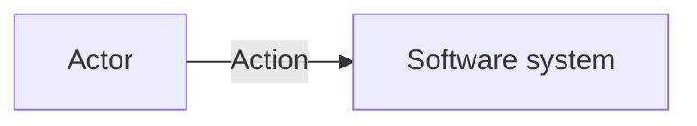

# <Diagram title>

**Audience:** <primary reader>

**Question:** <what this view explains>

**Scope:** <included/excluded>

**State:** <current | target | migration | failure scenario>

**Version/date:** <source version>

## What matters

-

## Boundaries and flows

## Assumptions and omissions

## Sources and related decisions

- Source:
- ADR:
- Runbook/API:

## Validation

- Mermaid render: [passed | failed | unavailable]
- Architecture review: [passed | pending]
