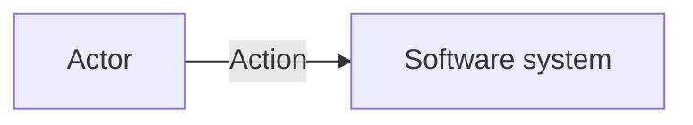

<!-- Optional standalone scaffold. Inherit repository documentation structure and remove fields that do not help answer the question. -->

# <Diagram title>

<One sentence stating the audience/question and current, target, migration, or failure state when needed.>

<Explain the boundaries, flows, assumptions, or omissions needed to interpret this view.>

## Sources and related decisions

- <source path, ADR, API, or runbook when useful>

## Validation

- Model/source comparison: <result or not performed>
- Mermaid syntax: <passed | failed | unavailable>
- Semantic-model validation: <passed | failed | unavailable | not applicable>
- Target render/readability: <passed | failed | unavailable>
- Aggregate-edge ambiguity: <passed | failed | not applicable>
- Rendered SVG accessibility metadata: <passed | failed | unavailable | not claimed>
- Remaining gaps: <none or scoped gap>
