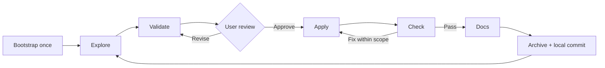

# Installation and workflow guide

### 1. Check the prerequisites

Use a local coding-agent environment with skill support, **Python 3.10+**, and **Git**. The commands below use a macOS/Linux shell. Stip does not install your application's dependencies.

```sh
python3 --version
git --version
```

### 2. Get this version of Stip

The rebuilt workflow is available on `main`. Clone the repository:

```sh
git clone https://github.com/BRYANN2K/stipulate-skills.git
cd stipulate-skills
```

This checkout supplies the installer and extension catalog. Your application lives in its own repository.

### 3. Install the seven core skills

For your user account, run these commands from the **Stipulate Skills checkout**:

```sh
python3 scripts/validate_skills.py
python3 scripts/install.py --destination "$HOME/.agents/skills" --dry-run
python3 scripts/install.py --destination "$HOME/.agents/skills"
```

The dry run previews the destination and package list. The install copies exactly seven `stip-*` packages, preserves unrelated skills, and refuses to overwrite foreign or locally modified copies. Each installed skill includes its own runtime.

For an installation limited to one project, use its physical path instead:

```sh
python3 scripts/install.py --destination "/absolute/path/to/your-project/.agents/skills" --dry-run
python3 scripts/install.py --destination "/absolute/path/to/your-project/.agents/skills"
```

Replace the example path before running it. Choose the user-level or project-level destination; you do not need both. Check your client's skill catalog after installation. If the skills are missing, open a new conversation and confirm the client supports the chosen discovery path. Client setup can vary; see the [official skills documentation](https://learn.chatgpt.com/docs/build-skills).

### 4. Open your application project and bootstrap it

Open the **target project** in Codex. In the chat composer, send:

```text
$stip-bootstrap Adopt this repository. Preserve its conventions, map its purpose
and existing foundations, and identify the relevant domain extensions.
```

For a new project, explain the intent in the same message. If it is not yet a Git repository, initialize Git there first:

```sh
git init
```

Bootstrap adds the workflow structure and guidance, while the agent fills in the project map from actual evidence. It does not choose a stack, install extensions, or create a sample feature automatically.

**You are ready to explore a feature.** The `$stip-*` examples are prompts for the agent, not shell commands. You do not need to run the Python lifecycle commands manually for everyday use.

## How it works



| Skill | What happens | Your role |
| --- | --- | --- |
| `$stip-bootstrap` | Maps the project and prepares `AGENTS.md` and `.workflow/`. | Explain the project intent and correct wrong assumptions. |
| `$stip-explore` | Explores the idea and brings in relevant available extensions. | Discuss outcomes, constraints, and tradeoffs. |
| `$stip-validate` | Turns the discussion into a specification with acceptance criteria. | Read, revise, and explicitly approve the current version. |
| `$stip-apply` | Implements and tests within the approved contract. | Clarify material questions if needed. |
| `$stip-check` | Compares every criterion with current evidence. | Review failures, missing evidence, and limitations. |
| `$stip-docs` | Updates documentation affected by the checked change. | Identify intended readers or missing explanations. |
| `$stip-archive` | Promotes the accepted spec, archives the change, and creates a scoped local commit. | Review the delivered result. Push/deploy remain separate actions. |

Bootstrap is project setup, not a task to repeat for each feature. Subsequent work starts with explore. Fixes within the agreed scope return to apply/check; new requirements return to validation and approval. Editing approved contract files also requires renewed approval.

## Walk through your first feature

This example adds a sign-in flow to an existing application. Adjust it to your project. If you want domain guidance, install the relevant extensions using the next section before exploration.

**Explore the idea:**

```text
$stip-explore Let's add a sign-in flow. Reuse the existing authentication system.
Discuss the user journey, error states, and what belongs in the first version.
Use the relevant installed extensions. Name this change add-login.
```

**Turn the discussion into a contract:**

```text
$stip-validate Prepare the add-login specification and show me the files to review.
Do not start implementation yet.
```

Read `.workflow/changes/add-login/proposal.md` and `spec.md`, plus `tasks.md` if useful. You can edit the files yourself or ask for revisions:

```text
Keep password reset outside this change. Include keyboard navigation and a clear
error when credentials are invalid. Update the spec so I can review it again.
```

**After reviewing the current version, approve and build:**

```text
I approve the current add-login specification. $stip-apply Implement it.
```

**Check and close:**

```text
$stip-check Verify add-login against every acceptance criterion.
```

After check passes:

```text
$stip-docs Update the documentation affected by add-login.
```

After documentation is complete:

```text
$stip-archive Archive add-login and create its scoped local commit.
```

The result is implemented code, evidence, updated documentation, an accepted specification, and an archived change. A failed or unverified criterion blocks completion. Archive does not push the commit or deploy the application.

## Add domain extensions

Extensions are local domain guidance, **not additional top-level skills or executable plugins**. The repository includes 28 optional packages. Installing the core and running bootstrap do not install them.

There are three distinct steps: **install into the project → make available through configuration → select for a particular change during explore**. The extension installer handles the first two; the agent selects only relevant packages during exploration.

From the **Stipulate Skills checkout**, after bootstrapping your target project:

```sh
python3 scripts/validate_extensions.py
python3 scripts/install_extensions.py --project "/absolute/path/to/your-project" \
  --extension frontend-engineering --extension accessibility --dry-run
python3 scripts/install_extensions.py --project "/absolute/path/to/your-project" \
  --extension frontend-engineering --extension accessibility
python3 scripts/workflow.py --root "/absolute/path/to/your-project" extensions
```

These commands copy the selected packages into `.workflow/extensions/` and update `.workflow/config.json`. They do not select extensions for an active change.

Then, in the target project's chat:

```text
$stip-explore Explore add-login using the installed frontend-engineering and
accessibility extensions. Reuse the existing UI and record relevant requirements
in the shared specification.
```

| Work you are doing | Example extension IDs |
| --- | --- |
| User interface | `frontend-engineering`, `ux-design`, `accessibility`, `design-system` |
| APIs and storage | `backend-engineering`, `api-integrations`, `database-engineering` |
| Cloud and delivery | `cloud-engineering`, `devops-delivery`, `sre-operations` |
| Product discovery | `product-strategy`, `user-research`, `storytelling` |
| Communication | `content-design`, `build-in-public` |

These are examples, not mandatory bundles. A selected extension contributes questions and requirements to the same change contract, then guidance for implementation, checking, and documentation. A build-in-public extension does not grant permission to publish.

See the [full catalog](../extensions/catalog.json) and [extension installation, selection, and update guide](extensions.md).

## What lives in your project

```text
AGENTS.md                    # Project instructions + bounded workflow guidance
.workflow/
  project.md                 # Intent, project map, commands, known gaps
  config.json                # Available extensions and workflow settings
  specs/                     # Currently accepted behavior
  extensions/                # Optional installed domain packages
  changes/
    add-login/
      proposal.md            # Why the change exists and decisions made
      spec.md                # Desired behavior and acceptance criteria
      tasks.md               # Optional implementation breakdown
      evidence.md            # Verification and delivery evidence
      state.json             # Lifecycle state and approved version digest
  archive/                   # Closed changes and their records
```

Bootstrap creates the initial structure; `add-login` only appears when you explore that actual change. `extensions/` is added when you install domain packages. Existing useful instructions and files are preserved. The agent assesses the project; the script does not infer its maturity from file names.

Accepted specifications describe current accepted behavior. A change specification describes the complete next version of its target. Keep these records with the project so decisions remain available across conversations.

## Updates and removal

From a clean Stipulate Skills checkout on `main`, fetch updates and rerun the installer for the destination you originally chose:

```sh
git pull --ff-only
python3 scripts/validate_skills.py
python3 scripts/install.py --destination "$HOME/.agents/skills" --dry-run
python3 scripts/install.py --destination "$HOME/.agents/skills"
```

The core installer replaces only owned, unchanged installations. Customized files must be preserved and reconciled first. Updating core skills does not replace an existing `AGENTS.md` workflow block or installed domain extensions. Follow the [extension update guidance](extensions.md#manual-configuration-and-updates) for domain packages.

To remove the owned, unchanged core copies:

```sh
python3 scripts/install.py --destination "$HOME/.agents/skills" --uninstall --dry-run
python3 scripts/install.py --destination "$HOME/.agents/skills" --uninstall
```

Use your project-level destination instead if that is where you installed. Uninstalling core skills leaves your project's `.workflow/` records and `AGENTS.md` intact.

## Troubleshooting

| Symptom | What to check |
| --- | --- |
| No `stip-*` skills appear | Verify the install destination, then refresh the client's catalog or open a new conversation. |
| `scripts/install.py` is missing | Confirm you are using the current `main` branch and are running commands from the Stipulate Skills checkout. |
| `Changed or foreign installation` | Preserve the local files and compare them with the package. The installer deliberately refuses an unsafe overwrite. |
| `Use a physical destination path` | Use an absolute path with no symlink components. |
| An extension is unavailable | Bootstrap first, install its exact catalog ID into that project, and inspect the runtime `extensions` output. |
| Approval is stale | Review changes to the proposal, spec, tasks, or selected extension guidance, then validate and approve again. |
| Check cannot pass | Resolve failed criteria and missing evidence; rerun check against the current source snapshot. |
| Archive refuses to commit | Read its error: staged files, changed HEAD, stale evidence, or pre-existing dirty files in the selected scope can block it. Preserve unrelated work. |

For contributors and deeper verification, run:

```sh
python3 scripts/validate_skills.py
python3 scripts/validate_extensions.py
python3 -m unittest discover -s tests -v
```

These repository tests are separate from the tests your application's acceptance criteria require. See [CONTRIBUTING.md](../CONTRIBUTING.md) for engine changes.

## Guarantees and limits

- Bootstrap preserves existing files and adds one bounded workflow block to AGENTS.md if absent. The agent performs the domain assessment; the script does not certify project maturity. An existing workflow block is not automatically replaced.
- Approval binds proposal, specification, optional tasks, and selected extension references. Any byte change invalidates approval, including editorial changes in this version.
- Check requires every acceptance criterion and a current snapshot of non-ignored Git working-tree files, including contents, symlinks, and executable bits. Ignored files and `.workflow/` are outside the code snapshot. External results require identifiable evidence in the report.
- Evidence consists of inspectable attestations. The script cannot establish whether a human or agent reported truthfully. Local state is neither an authenticated signature system nor a barrier against a malicious operator with write access.
- Archive rejects stale source evidence, a nonempty index, selected files already dirty at start, a changed HEAD, and concurrent changes to the target specification. It does not absorb unrelated work or push commits.
- Snapshot schema v1 does not support submodules. Use the physical repository root. CI targets Linux and macOS; local delivery checks do not establish that remote CI has passed.

Tests cover the engine, installation, and synthetic lifecycle runs for all 28 extensions. Evaluating Astra's behavior on real projects is a separate activity. Passing core tests does not certify a product as production-ready.

[Core contract and commands](workflow.md) · [Extensions](extensions.md) · [Contributing](../CONTRIBUTING.md) · [Security](../SECURITY.md)

The previous collection of 33 skills remains in Git history and migration backups. Its skill directories are not retained in this version's discovery paths.

## Migration to Stip

The seven public skill names now use `stip-` instead of `spec-`. Install the new packages, then remove only unchanged legacy packages using the previous installer. Preserve customized installations for reconciliation. `.workflow/`, runtime subcommands, approval records, and archive formats are unchanged. Bootstrap preserves existing AGENTS.md workflow blocks: update their skill references explicitly when adopting Stip. Internal `spec-workflow` block markers and ownership identifiers remain stable for compatibility.
