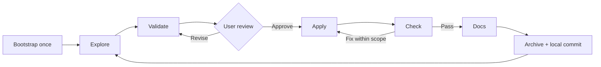

# Installation and workflow guide

### 1. Check the prerequisites

Use Codex, Claude Code, Grok Build, or OpenCode v2, Node.js/npm for `npx`, Python 3.10+, and Git. Commands use a macOS/Linux shell. Stip does not install application dependencies.

### 2. Install the full package

For OpenCode skills **and slash commands together**, run `npx github:BRYANN2K/stipulate-skills` from the project, or append `--global` for user-wide installation. Then use `/restart` in any already open OpenCode session. Re-run this launcher for updates.

The alternative below installs skills only:

From your application project directory:

```sh
npx skills add BRYANN2K/stipulate-skills --skill '*' --agent codex
```

This installs the seven core skills together, including the complete 28-extension catalog bundled inside `stip-bootstrap`. No repository clone or separate extension installation is required. Quote `'*'` to prevent shell expansion.

For user-wide installation, add `--global`. Choose project-local or global installation; you do not need both. Check Codex's skill catalog and start a new conversation if needed. See the [skills CLI documentation](https://github.com/vercel-labs/skills) for supported agents and installer options.

For another client, replace `codex` with `claude-code` or `opencode`; Grok Build discovers the project-local shared installation made with `--agent codex`; multiple IDs can follow `--agent`. All clients receive the same seven packages and bundled extensions. See [client setup](clients.md).

### 3. Alternative: install without Node.js

From a clone of this repository, the Python installer copies the same complete packages:

```sh
git clone https://github.com/BRYANN2K/stipulate-skills.git
cd stipulate-skills
python3 scripts/install.py --destination "/absolute/path/to/your-project/.agents/skills" --dry-run
python3 scripts/install.py --destination "/absolute/path/to/your-project/.agents/skills"
```

Use `"$HOME/.agents/skills"` for user-wide installation. This installer preserves unrelated skills and rejects foreign or locally modified packages. **Use one installer per destination:** the Python installer does not adopt installations managed by `npx skills`.

### 4. Open your application project and bootstrap it

Open the **target project** in your coding client. The prompts below use Codex syntax; use `/stip-*` instead of `$stip-*` in Claude Code, Grok Build, and OpenCode v2. In the chat composer, send:

```text
$stip-bootstrap Adopt this repository. Preserve its conventions, map its purpose
and existing foundations, and identify the relevant domain extensions.
```

For a new project, explain the intent in the same message. If it is not yet a Git repository, initialize Git there first:

```sh
git init
```

Bootstrap adds the workflow structure and guidance, while the agent fills in the project map from actual evidence. The bundled setup installs all 28 extensions as available, preserving existing configured packages and disabled entries. It does not choose a stack, select domains for a change, or create a sample feature.

Bootstrap adds an `@AGENTS.md` import to `CLAUDE.md` for Claude Code, preserving existing instructions. Restart Claude Code after first setup to load project instructions at session start.

**You are ready to explore a feature.** The `$stip-*` examples are prompts for the agent, not shell commands. You do not need to run the Python lifecycle commands manually for everyday use.

## How it works



| Skill | What happens | Your role |
| --- | --- | --- |
| `$stip-bootstrap` | Maps the project and prepares `AGENTS.md` and `.workflow/`. | Explain the project intent and correct wrong assumptions. |
| `$stip-explore` | Explores the idea and brings in relevant available extensions. | Discuss outcomes, constraints, and tradeoffs. |
| `$stip-validate` | Turns the discussion into a specification with acceptance criteria. | Read, revise, and explicitly approve the current version. |
| `$stip-apply` | Implements and tests within the approved contract. | Clarify material questions if needed. |
| `$stip-check` | Compares every criterion with current evidence. | Review failures, missing evidence, and limitations. |
| `$stip-docs` | Updates documentation affected by the checked change. | Identify intended readers or missing explanations. |
| `$stip-archive` | Promotes the accepted spec, archives the change, and creates a scoped local commit. | Review the delivered result. Push/deploy remain separate actions. |

Bootstrap is project setup, not a task to repeat for each feature. Subsequent work starts with explore. Fixes within the agreed scope return to apply/check; new requirements return to validation and approval. Editing approved contract files also requires renewed approval.

## Walk through your first feature

This example adds a sign-in flow to an existing application. Adjust it to your project. The catalog is already available after bootstrap; select relevant domains during exploration.

**Explore the idea:**

```text
$stip-explore Let's add a sign-in flow. Reuse the existing authentication system.
Discuss the user journey, error states, and what belongs in the first version.
Use the relevant installed extensions. Name this change add-login.
```

**Turn the discussion into a contract:**

```text
$stip-validate Prepare the add-login specification and show me the files to review.
Do not start implementation yet.
```

Read `.workflow/changes/add-login/proposal.md` and `spec.md`, plus `tasks.md` if useful. You can edit the files yourself or ask for revisions:

```text
Keep password reset outside this change. Include keyboard navigation and a clear
error when credentials are invalid. Update the spec so I can review it again.
```

**After reviewing the current version, approve and build:**

```text
I approve the current add-login specification. $stip-apply Implement it.
```

**Check and close:**

```text
$stip-check Verify add-login against every acceptance criterion.
```

After check passes:

```text
$stip-docs Update the documentation affected by add-login.
```

After documentation is complete:

```text
$stip-archive Archive add-login and create its scoped local commit.
```

The result is implemented code, evidence, updated documentation, an accepted specification, and an archived change. A failed or unverified criterion blocks completion. Archive does not push the commit or deploy the application.


## Use the relevant extensions

Bootstrap makes all 28 domain packages available in the project. There is no additional installation step. During exploration, ask for the domains that fit the work, or let the agent propose a selection:

```text
$stip-explore Explore add-login using frontend-engineering and accessibility.
Reuse the existing UI and record relevant requirements in the shared specification.
```

Available does not mean selected or loaded. A cloud change can select `cloud-engineering` and `devops-delivery` without loading design guidance. Each selected domain contributes to the same contract, implementation, checks, and documentation. A build-in-public extension does not grant permission to publish.

See the [catalog and advanced configuration guide](extensions.md).

## What lives in your project

```text
AGENTS.md                    # Project instructions + bounded workflow guidance
.workflow/
  project.md                 # Intent, project map, commands, known gaps
  config.json                # Available extensions and workflow settings
  specs/                     # Currently accepted behavior
  extensions/                # Optional installed domain packages
  changes/
    add-login/
      proposal.md            # Why the change exists and decisions made
      spec.md                # Desired behavior and acceptance criteria
      tasks.md               # Optional implementation breakdown
      evidence.md            # Verification and delivery evidence
      state.json             # Lifecycle state and approved version digest
  archive/                   # Closed changes and their records
```

Bootstrap creates the initial structure; `add-login` only appears when you explore that actual change. `extensions/` is populated by the bundled bootstrap setup. Existing useful instructions and files are preserved. The agent assesses the project; the script does not infer its maturity from file names.

Accepted specifications describe current accepted behavior. A change specification describes the complete next version of its target. Keep these records with the project so decisions remain available across conversations.

## Updates and removal

For an installation managed by the skills CLI:

```sh
npx skills check
npx skills update
```

These commands check or update installed skills, including their bundled resources. Run `npx skills remove` and select the Stip skills to uninstall; use `--global` for a global installation. Consult the CLI prompts before confirming changes to other installed skills.

Re-running `$stip-bootstrap` adds missing catalog packages but preserves configured project copies, disabled entries, existing guidance, and active changes. Updating installed skills does not silently replace project extension references; reconcile those explicitly using the [extension update guide](extensions.md#manual-configuration-and-updates).

For the alternative **Python-managed installation**, from a clean Stipulate Skills checkout on `main`, fetch updates and rerun the installer for the destination you originally chose:

```sh
git pull --ff-only
python3 scripts/validate_skills.py
python3 scripts/install.py --destination "$HOME/.agents/skills" --dry-run
python3 scripts/install.py --destination "$HOME/.agents/skills"
```

The core installer replaces only owned, unchanged installations. Customized files must be preserved and reconciled first. Updating core skills does not replace an existing `AGENTS.md` workflow block or installed domain extensions. Follow the [extension update guidance](extensions.md#manual-configuration-and-updates) for domain packages.

To remove the owned, unchanged core copies:

```sh
python3 scripts/install.py --destination "$HOME/.agents/skills" --uninstall --dry-run
python3 scripts/install.py --destination "$HOME/.agents/skills" --uninstall
```

Use your project-level destination instead if that is where you installed. Uninstalling core skills leaves your project's `.workflow/` records and `AGENTS.md` intact.

## Troubleshooting

| Symptom | What to check |
| --- | --- |
| No `stip-*` skills appear | Verify the install destination, then refresh the client's catalog or open a new conversation. |
| `scripts/install.py` is missing | Confirm you are using the current `main` branch and are running commands from the Stipulate Skills checkout. |
| `Changed or foreign installation` | Preserve the local files and compare them with the package. The installer deliberately refuses an unsafe overwrite. |
| `Use a physical destination path` | Use an absolute path with no symlink components. |
| An extension is unavailable | Run the current `$stip-bootstrap`, then inspect configuration for a disabled entry or invalid local path. |
| Approval is stale | Review changes to the proposal, spec, tasks, or selected extension guidance, then validate and approve again. |
| Check cannot pass | Resolve failed criteria and missing evidence; rerun check against the current source snapshot. |
| Archive refuses to commit | Read its error: staged files, changed HEAD, stale evidence, or pre-existing dirty files in the selected scope can block it. Preserve unrelated work. |

For contributors and deeper verification, run:

```sh
python3 scripts/validate_skills.py
python3 scripts/validate_extensions.py
python3 -m unittest discover -s tests -v
```

These repository tests are separate from the tests your application's acceptance criteria require. See [CONTRIBUTING.md](../CONTRIBUTING.md) for engine changes.

## Guarantees and limits

- Bootstrap preserves existing files and adds one bounded workflow block to AGENTS.md if absent. The agent performs the domain assessment; the script does not certify project maturity. An existing workflow block is not automatically replaced.
- Approval binds proposal, specification, optional tasks, and selected extension references. Any byte change invalidates approval, including editorial changes in this version.
- Check requires every acceptance criterion and a current snapshot of non-ignored Git working-tree files, including contents, symlinks, and executable bits. Ignored files and `.workflow/` are outside the code snapshot. External results require identifiable evidence in the report.
- Evidence consists of inspectable attestations. The script cannot establish whether a human or agent reported truthfully. Local state is neither an authenticated signature system nor a barrier against a malicious operator with write access.
- Archive rejects stale source evidence, a nonempty index, selected files already dirty at start, a changed HEAD, and concurrent changes to the target specification. It does not absorb unrelated work or push commits.
- Snapshot schema v1 does not support submodules. Use the physical repository root. CI targets Linux and macOS; local delivery checks do not establish that remote CI has passed.

Tests cover the engine, installation, and synthetic lifecycle runs for all 28 extensions. Evaluating Astra's behavior on real projects is a separate activity. Passing core tests does not certify a product as production-ready.

[Core contract and commands](workflow.md) · [Extensions](extensions.md) · [Contributing](../CONTRIBUTING.md) · [Security](../SECURITY.md)

The previous collection of 33 skills remains in Git history and migration backups. Its skill directories are not retained in this version's discovery paths.

## Migration to Stip

The seven public skill names now use `stip-` instead of `spec-`. Install the new packages, then remove only unchanged legacy packages using the previous installer. Preserve customized installations for reconciliation. `.workflow/`, runtime subcommands, approval records, and archive formats are unchanged. Bootstrap preserves existing AGENTS.md workflow blocks: update their skill references explicitly when adopting Stip. Internal `spec-workflow` block markers and ownership identifiers remain stable for compatibility.
